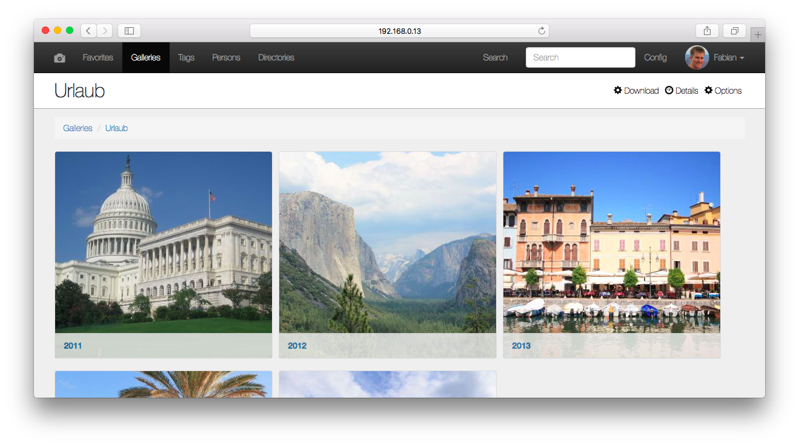

# Image Viewer

This is a Node application to access local stored images. I have started this project to list all the images stored on a NAS and to tag and categorize them. And of course to learn Node and Express. 
It is still in development and not finished yet, but I already use it on my Raspberry Pi. It is not easy to install and it needs a lot of manual steps to start the application.





## Install on Raspberry Pi


### PostgreSQL

### Redis

```
sudo apt-get install redis-server
```

### Install Image Viewer
...

```
npm install
```

### Using in Cluster with PM2

npm install pm2 --global

pm2 start bin/www -i 0 --name "viewer"

